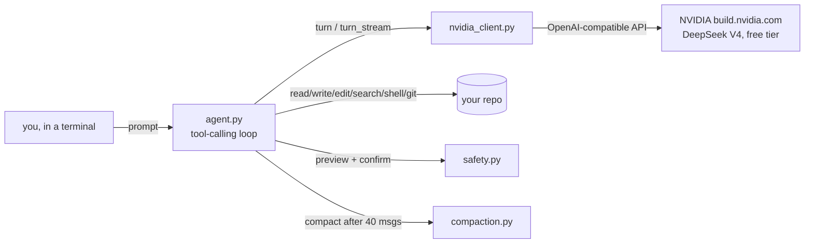

# OpenCodingAgent

[](https://github.com/Hamzah-Muhammad/OpenCodingAgent/actions/workflows/ci.yml)
[](LICENSE)
[](pyproject.toml)
[](#why-free)

**A free coding agent for your terminal.** OpenCodingAgent reads/searches/writes/edits files, runs shell commands, and uses git in a real repo on your machine — the same shape of tool as Claude Code or Aider — but it's built specifically to run on **free LLM APIs**, not a paid key. Point it at NVIDIA's free-tier DeepSeek V4 endpoint, clone this repo, and you have a working coding agent for $0.

## Why free

Every other terminal coding agent worth using assumes you're paying per token. OpenCodingAgent doesn't: it's wired to [NVIDIA's build.nvidia.com API](https://build.nvidia.com), which serves DeepSeek V4 (and other open-weight models) at no cost, no credit card required. That's a real tradeoff — a free, smaller model is less reliable than a frontier paid one — so the whole design leans into managing that: terse system prompt, targeted `edit_file` over blind `write_file` overwrites, a hard cap on tool-call round trips, and automatic conversation compaction so a long session doesn't blow through a smaller model's context window. See [Known limitations](#known-limitations-v1) for what that tradeoff actually costs you.

## Quick start

```bash
git clone https://github.com/Hamzah-Muhammad/OpenCodingAgent.git
cd OpenCodingAgent

python -m venv .venv
.venv\Scripts\pip install -r requirements.txt      # Windows
# source .venv/bin/activate && pip install -r requirements.txt   # macOS/Linux

cp .env.example .env
# edit .env: paste in a free key from https://build.nvidia.com
```

Then run it from whatever repo you want it to work on:

```bash
cd path\to\your\project
python -m open_coding_agent
```

The agent's file/shell/git tools are jailed to the directory you run it from (or pass `--root` to point it somewhere else).

## In-session commands

- `/model <name>` — override the default model (`deepseek-ai/deepseek-v4-flash-0731`)
- `/help`, `/exit`

## Safety

Reading/searching files/directories and `git status`/`git diff` run automatically. Writing files, editing files, running shell commands, git commits, branch creation, and git push always show a preview (diff / literal command / branch name / commit list) and require `y` to proceed. `a` auto-approves further file writes/edits for the rest of the session — `run_shell` always asks regardless. `q` cancels the current turn.

**A single message is capped at 25 tool-call round trips** (`agent.py`) — a weak/free model stuck oscillating on a bad tool call, or repeatedly emitting malformed arguments, stops there instead of running forever. The conversation so far is kept; send another message to continue.

**Provider failures come back as a clean message, not a bare 500.** Free-tier providers fail in ways worth surfacing plainly — rate limits, overload, a malformed tool call the SDK itself rejects. `nvidia_client.py` catches these at the API-call boundary and re-raises as a readable `NvidiaError`, instead of an unhandled exception turning into a stack trace.

**`edit_file`** is a targeted search/replace (find `old_text`, replace with `new_text`) rather than `write_file`'s full overwrite — the fix for the "weak model overwrites the whole file" failure mode. It refuses if `old_text` isn't found, or if it's ambiguous (appears more than once) unless `replace_all` is set — both refusals show up in the preview itself, so you see *why* before being asked to approve anything.

**`git_push` and `pr_create`** have their guardrails built into the tool itself, not just the confirmation prompt — a model can't work around them by phrasing the call differently:
- **No branch, remote, or force parameter exists on `git_push` at all.** It always pushes exactly "the branch you're currently on" to `origin`. Force-push isn't reachable through this tool no matter what the model asks for.
- **Refuses outright on `main`/`master`**, both in the preview (so you see the refusal before approving anything) and again in the executor itself. Work happens on a feature branch (`git_checkout_branch`), pushed, then opened as a PR — the agent never touches `main`.
- **`pr_create`** opens a pull request from the current branch into `main`, via the `gh` CLI — same "delegate to already-authenticated tooling, hold no credential itself" pattern as `git_push`. It refuses if the branch hasn't actually been pushed to `origin` yet, so it can't be used to route around `git_push`'s checks.

## Streaming and token usage

Responses render live instead of waiting for the whole thing — text shows up as it's generated, via a `rich.live.Live` panel that updates in place. Tool-call argument fragments are never streamed incrementally (a half-parsed JSON string isn't useful to show anyone); they're assembled from the delta stream and only appear once complete.

**Every response shows token usage** — the current turn's input/output tokens plus a running session total. On a free tier without a bill to watch, this is the next best thing: you can see exactly how much context each turn is costing you.

**Long sessions get compacted automatically** once the conversation passes 40 messages: older turns collapse into one durable-facts summary via an extra model call, keeping the most recent 10 messages verbatim. Compaction never cuts in the middle of a tool-call ↔ tool-result exchange — the turn loop only ever assigns role `"user"` to genuine new user input, so cutting exactly at a `"user"` message is always a clean boundary.

## Dev usage

```bash
python -m venv .venv
.venv\Scripts\pip install -r requirements-dev.txt
.venv\Scripts\python -m open_coding_agent
```

CLI flags (`--model`, `--api-key`, `--root`) work for direct `python -m open_coding_agent` use, or set them in `.env` (`NVIDIA_API_KEY`, `OPENCODINGAGENT_MODEL`).

## Architecture



No backend service, no database, no account. `nvidia_client.py` talks directly to NVIDIA's API using the standard `openai` Python SDK, just pointed at a different `base_url` — NVIDIA's endpoint implements the same request/response shape OpenAI's own API does, so no custom protocol was needed.

## Known limitations (v1)

- **Free/small models occasionally guess wrong tool arguments or emit a malformed function call.** The session recovers (the tool boundary rejects escaping paths; malformed JSON comes back as a readable error the model can retry from), but you may see a retry or two before it converges. This is the real cost of "free" — budget for it.
- `write_file` is still a full-file overwrite — `edit_file` (targeted search/replace) is the preferred tool for changes to an existing file, and the system prompt tells the model that, but a weak/fast model can still reach for `write_file` out of habit.
- `search_files` is a plain Python regex + `fnmatch` walk, not an indexed search — fine for a single repo, but it re-walks the tree on every call with no caching, so it'll get slow on a genuinely large monorepo.
- **NVIDIA's build.nvidia.com catalog rotates models on short notice** — if the default model starts erroring with a 404/410, check `https://integrate.api.nvidia.com/v1/models` (`Authorization: Bearer <NVIDIA_API_KEY>`) for the current model id and set `OPENCODINGAGENT_MODEL`.
- `git_push` and `pr_create` both target `origin`/`main` only — no support for a repo with multiple remotes, and no way to push or open a PR against a branch under a different name than its local one (deliberate: fewer parameters means fewer ways to push somewhere unintended).
- `pr_create` shells out to the `gh` CLI, so it errors clearly if `gh` isn't installed or isn't logged in (`gh auth login`) — it doesn't fall back to the GitHub REST API.
- Clone automation (checking out a repo the agent doesn't already have locally) isn't built — point it at a repo you've already cloned.

## Project layout

```
open_coding_agent/
  __main__.py         CLI entrypoint (argparse, session bootstrap)
  agent.py             The tool-calling loop: call model -> execute tools -> feed results back
  config.py             Env/CLI config loading
  nvidia_client.py       Direct calls to NVIDIA's OpenAI-compatible API (turn/turn_stream)
  compaction.py            Conversation compaction once history grows past 40 messages
  memory.py                 Loads SYSTEM_PROMPT.md
  safety.py                  Confirmation prompts + auto-approve state
  ui.py                       Rich-based terminal rendering (streaming panel, previews)
  SYSTEM_PROMPT.md              The agent's own system prompt
  tools/
    fs.py                       read_file, list_dir, write_file, edit_file (+ previews)
    search.py                    search_files (grep + glob, one tool for both)
    shell.py                      run_shell
    git.py                         status/diff/commit/checkout/push (+ main/master refusal)
    github.py                       pr_create via the gh CLI
    schemas.py                       Tool-call JSON schemas + safe/risky classification
tests/                 pytest suite -- fs, search, safety, compaction, git/PR guardrails
                        (against real local git repos, not mocks), the NVIDIA client
```

## Testing

```bash
python -m venv .venv
.venv\Scripts\pip install -r requirements-dev.txt
.venv\Scripts\python -m pytest
.venv\Scripts\python -m ruff check open_coding_agent/ tests/
.venv\Scripts\python -m black --check open_coding_agent/ tests/
```

`tests/test_git.py` and `tests/test_github.py` exercise the push/PR guardrails against real local git repos (a throwaway repo + a local bare repo standing in for `origin`, both in `tmp_path` — no network or GitHub credentials involved), not mocks — including a real push over a local remote to confirm the allowed path actually works, not just that the refusals fire.

## License

MIT
