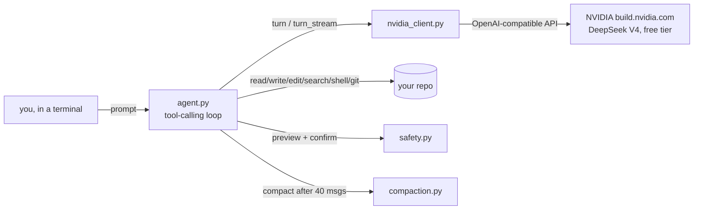

# OpenCodingAgent

[](https://github.com/Hamzah-Muhammad/OpenCodingAgent/actions/workflows/ci.yml)
[](LICENSE)
[](pyproject.toml)
[](#why-free)

**A free coding agent for your terminal, on an open-weight model.** OpenCodingAgent reads/searches/writes/edits files, runs shell commands, and uses git in a real repo on your machine -- the same shape of tool as Claude Code or Aider -- but it's built specifically to run on **free, open-weight LLMs**, not a paid key. Point it at NVIDIA's free-tier DeepSeek V4 endpoint, clone this repo, and you have a working coding agent for $0, confined to one sandbox folder so it can never touch anything you didn't hand it.

## What this project demonstrates

This repo exists to show how I build agents and coding tools. A working agent is a model plus four things the harness gives it, and every one of them here is a deliberate, tested decision rather than a framework default:

| Pillar | What it means in OpenCodingAgent | Where |
|---|---|---|
| **Tools** | 12 tools with tight JSON schemas, each classified `safe` (auto-runs) or `risky` (diff/command preview + `y`/`a`/`q`). Guardrails live *inside* the tool, not in the prompt: no branch/force parameter on `git_push`, refusal on `main`, sandbox-by-name and secrets refusal at the boundary, cross-platform path normalisation. Every tool failure comes back to the model as a readable result so it can adapt instead of crashing the session. | `tools/schemas.py`, `tools/*.py`, `safety.py`, `agent.py` |
| **System prompt** | Short and model-aware: written for a free, smaller model and a narrow terminal (tool discipline, `edit_file` over overwrites, no re-reads, checkpoint before the turn cap, honest about what it is). Loaded once from a flat file and bundled into the exe; a tiered prompt was considered and rejected as unnecessary at this size, which is itself the point. | `SYSTEM_PROMPT.md`, `memory.py` |
| **Context window** | Streaming with per-turn and per-session token accounting so the cost of every turn is visible. A 25-round-trip cap per message. Automatic compaction after 40 messages into a durable-facts summary that keeps the last 10 messages verbatim and never cuts between a tool call and its result. Tool output is bounded (shell 4,000 chars, search 50 hits, files over 1 MB skipped) and hidden reasoning is off by default so the output budget is not burned invisibly. | `compaction.py`, `ui.py`, `tools/shell.py`, `tools/search.py`, `nvidia_client.py` |
| **Memory** | Three layers, each with one job: durable identity and rules (`SYSTEM_PROMPT.md`, cached for the session), the conversation itself (rolled back to the last user turn on any failure so it can never hold an orphaned tool call), and the compaction summary, which is the agent's long-session memory of decisions made, files touched, and what is still open. | `memory.py`, `agent.py`, `compaction.py` |

The same four decisions are what separate a demo that calls an LLM from a tool you can hand a real repo to. The rest of this README is the operator's view of those decisions.

## Why free

Every other terminal coding agent worth using assumes you're paying per token. OpenCodingAgent doesn't: it's wired to [NVIDIA's build.nvidia.com API](https://build.nvidia.com), which serves DeepSeek V4 (and other open-weight models) at no cost, no credit card required. That's a real tradeoff -- a free, smaller model is less reliable than a frontier paid one -- so the whole design leans into managing that: terse system prompt, targeted `edit_file` over blind `write_file` overwrites, a hard cap on tool-call round trips, and automatic conversation compaction so a long session doesn't blow through a smaller model's context window. See [Known limitations](#known-limitations-v1) for what that tradeoff actually costs you.

## Quick start (Windows, double-click)

`OpenCodingAgent.exe` is checked into the repo root -- grab it from `git clone` or the **[Releases page](https://github.com/Hamzah-Muhammad/OpenCodingAgent/releases/latest)**, no Python install needed. It's a single self-contained file:

1. Get a free key at [build.nvidia.com](https://build.nvidia.com) (no credit card).
2. Set it once: `setx NVIDIA_API_KEY "your-key-here"` (new terminal windows only) -- or just create a `.env` file with `NVIDIA_API_KEY=your-key-here` next to the exe.
3. Create a folder named **`OpenCodingAgentRepo`** (anywhere), put or clone the project you want it to work on inside it, drop `OpenCodingAgent.exe` in next to it, and double-click. That folder name is the sandbox: every file/shell/git tool is confined to it (see [The sandbox](#the-sandbox)). Run from anywhere else and it refuses with instructions instead of guessing.

## Quick start (from source)

Windows (PowerShell):

```powershell
git clone https://github.com/Hamzah-Muhammad/OpenCodingAgent.git
cd OpenCodingAgent

python -m venv .venv
.venv\Scripts\python -m pip install -r requirements.txt
.venv\Scripts\python -m pip install -e .        # installs the `opencodingagent` command into the venv
Copy-Item .env.example .env      # then paste in a free key from https://build.nvidia.com
```

macOS / Linux:

```bash
git clone https://github.com/Hamzah-Muhammad/OpenCodingAgent.git
cd OpenCodingAgent

python3 -m venv .venv && source .venv/bin/activate
pip install -r requirements.txt
pip install -e .                 # installs the `opencodingagent` command into the venv
cp .env.example .env             # then paste in a free key from https://build.nvidia.com
```

Then create the sandbox folder, put the project you want it to work on inside, and run it from there (with the venv active, or via its full path):

```bash
mkdir OpenCodingAgentRepo && cd OpenCodingAgentRepo
git clone <the repo you want it to work on>
opencodingagent                      # or from anywhere: opencodingagent --root path/to/OpenCodingAgentRepo
```

(`python -m open_coding_agent` does the same thing when run from this repo's root.)

The agent refuses to start in a directory with any other name; see [The sandbox](#the-sandbox).

## In-session commands

- `/model <name>` -- override the default model (`deepseek-ai/deepseek-v4-flash-0731`)
- `/help`, `/exit`

## The sandbox

The agent only ever operates inside a directory named **`OpenCodingAgentRepo`**. That is enforced at the tool boundary (`tools/fs.py`), not just at startup: every file, search, shell, git and PR call re-checks the root's *name* before doing anything, so a typo, a stray `cd`, or a relative path in a model-supplied argument can never widen it.

- With no `--root` it uses the current directory if that is the sandbox, else `~/OpenCodingAgentRepo` if it exists, else it refuses and prints the three steps to set one up. The banner always shows the sandbox it settled on.
- Containment is checked on the **real** path: symlinks and Windows directory junctions are resolved first, so a link planted inside the sandbox that points elsewhere is refused, and so is a junction *named* `OpenCodingAgentRepo` that points somewhere else. Cross-drive paths (`D:\...` from a `C:` sandbox) are refused too.
- `.git/` is hidden from `list_dir` and `search_files`, and secrets files (`.env`, `*.pem`, `*.key`, `id_rsa*`, `credentials*.json`, ...) are refused by every file tool, read and write alike: their contents must never be sent to a third-party model. `.env.example` is still readable.

`tests/test_sandbox_lock.py` covers each of these with real junctions/symlinks on disk, and `tests/test_secrets_and_newlines.py` covers the secrets refusal.

## Thinking mode

DeepSeek V4 on NVIDIA is a reasoning model. Left to its defaults it spends the whole output budget on hidden reasoning before the first visible token: in a live run every step took minutes and short answers came back empty with `finish_reason: length`. OpenCodingAgent therefore sends `chat_template_kwargs: {"thinking": false}` by default, which turned a three-minute first answer into a few seconds. `--thinking on` (or `OPENCODINGAGENT_THINKING=on`) turns reasoning back on for a hard problem; `--thinking auto` sends no flag at all, for a model whose chat template has no such switch.

## Safety

Reading/searching files/directories and `git status`/`git diff` run automatically. Writing files, editing files, running shell commands, git commits, branch creation, and git push always show a preview (diff / literal command / branch name / commit list) and require `y` to proceed. `a` auto-approves further file writes/edits for the rest of the session -- `run_shell` always asks regardless. `q` cancels the current turn.

**A single message is capped at 25 tool-call round trips** (`agent.py`) -- a weak/free model stuck oscillating on a bad tool call, or repeatedly emitting malformed arguments, stops there instead of running forever. The conversation so far is kept; send another message to continue.

**Provider failures come back as a clean message, not a bare 500.** Free-tier providers fail in ways worth surfacing plainly -- rate limits, overload, a malformed tool call the SDK itself rejects. `nvidia_client.py` catches these at the API-call boundary and re-raises as a readable `NvidiaError`, instead of an unhandled exception turning into a stack trace.

**`edit_file`** is a targeted search/replace (find `old_text`, replace with `new_text`) rather than `write_file`'s full overwrite -- the fix for the "weak model overwrites the whole file" failure mode. It refuses if `old_text` isn't found, or if it's ambiguous (appears more than once) unless `replace_all` is set -- both refusals show up in the preview itself, so you see *why* before being asked to approve anything. Edits and rewrites preserve the file's existing line endings (CRLF stays CRLF, LF stays LF) instead of letting the platform's default newline translation rewrite them one edit at a time.

**`git_push` and `pr_create`** have their guardrails built into the tool itself, not just the confirmation prompt -- a model can't work around them by phrasing the call differently:
- **No branch, remote, or force parameter exists on `git_push` at all.** It always pushes exactly "the branch you're currently on" to `origin`. Force-push isn't reachable through this tool no matter what the model asks for.
- **Refuses outright on `main`/`master`**, both in the preview (so you see the refusal before approving anything) and again in the executor itself. Work happens on a feature branch (`git_checkout_branch`), pushed, then opened as a PR -- the agent never touches `main`.
- **`pr_create`** opens a pull request from the current branch into `main`, via the `gh` CLI -- same "delegate to already-authenticated tooling, hold no credential itself" pattern as `git_push`. It refuses if the branch hasn't actually been pushed to `origin` yet, so it can't be used to route around `git_push`'s checks.

## Streaming and token usage

Responses render live instead of waiting for the whole thing -- text shows up as it's generated, via a `rich.live.Live` panel that updates in place. Tool-call argument fragments are never streamed incrementally (a half-parsed JSON string isn't useful to show anyone); they're assembled from the delta stream and only appear once complete.

**Every response shows token usage** -- the current turn's input/output tokens plus a running session total. On a free tier without a bill to watch, this is the next best thing: you can see exactly how much context each turn is costing you.

**Long sessions get compacted automatically** once the conversation passes 40 messages: older turns collapse into one durable-facts summary via an extra model call, keeping the most recent 10 messages verbatim. Compaction never cuts in the middle of a tool-call ↔ tool-result exchange -- the turn loop only ever assigns role `"user"` to genuine new user input, so cutting exactly at a `"user"` message is always a clean boundary.

## Dev usage

```bash
python -m venv .venv
.venv\Scripts\python -m pip install -r requirements-dev.txt
.venv\Scripts\python -m pip install -e .
.venv\Scripts\python -m open_coding_agent --root path	o\OpenCodingAgentRepo
```

CLI flags (`--model`, `--api-key`, `--root`, `--thinking`, `--version`) work for direct `python -m open_coding_agent` use, or set them in `.env` (`NVIDIA_API_KEY`, `OPENCODINGAGENT_MODEL`, `OPENCODINGAGENT_THINKING`).

## Rebuilding OpenCodingAgent.exe

```bash
python -m venv .venv
.venv\Scripts\python -m pip install -r requirements-dev.txt
.venv\Scripts\python -m PyInstaller OpenCodingAgent.spec --noconfirm
```

Onefile build with the embedded icon and version resource (`--add-data` bundles `SYSTEM_PROMPT.md` into the archive -- `memory.py` knows to look for it at `sys._MEIPASS` when frozen). Output: `dist/OpenCodingAgent.exe`. The root-level `OpenCodingAgent.exe` is rebuilt and re-committed whenever app code changes, so it always matches the latest source.

## Architecture



No backend service, no database, no account. `nvidia_client.py` talks directly to NVIDIA's API using the standard `openai` Python SDK, just pointed at a different `base_url` -- NVIDIA's endpoint implements the same request/response shape OpenAI's own API does, so no custom protocol was needed.

## Known limitations (v1)

- **Free/small models occasionally guess wrong tool arguments or emit a malformed function call.** The session recovers (the tool boundary rejects escaping paths; malformed JSON comes back as a readable error the model can retry from; a response truncated mid tool-call is discarded rather than left as a dangling `tool_calls` message that would poison every later request), but you may see a retry or two before it converges. This is the real cost of "free" -- budget for it.
- `write_file` is still a full-file overwrite -- `edit_file` (targeted search/replace) is the preferred tool for changes to an existing file, and the system prompt tells the model that, but a weak/fast model can still reach for `write_file` out of habit.
- `search_files` is a plain Python regex + `fnmatch` walk, not an indexed search -- fine for a single repo, but it re-walks the tree on every call with no caching, so it'll get slow on a genuinely large monorepo.
- **NVIDIA's build.nvidia.com catalog rotates models on short notice** -- if the default model starts erroring with a 404/410, check `https://integrate.api.nvidia.com/v1/models` (`Authorization: Bearer <NVIDIA_API_KEY>`) for the current model id and set `OPENCODINGAGENT_MODEL`.
- `git_push` and `pr_create` both target `origin`/`main` only -- no support for a repo with multiple remotes, and no way to push or open a PR against a branch under a different name than its local one (deliberate: fewer parameters means fewer ways to push somewhere unintended).
- `pr_create` shells out to the `gh` CLI, so it errors clearly if `gh` isn't installed or isn't logged in (`gh auth login`) -- it doesn't fall back to the GitHub REST API.
- Clone automation (checking out a repo the agent doesn't already have locally) isn't built -- point it at a repo you've already cloned.

## Project layout

```
open_coding_agent/
  __main__.py         CLI entrypoint (argparse, session bootstrap)
  agent.py             The tool-calling loop: call model -> execute tools -> feed results back
  config.py             Env/CLI config loading
  nvidia_client.py       Direct calls to NVIDIA's OpenAI-compatible API (turn/turn_stream)
  compaction.py            Conversation compaction once history grows past 40 messages
  memory.py                 Loads SYSTEM_PROMPT.md
  safety.py                  Confirmation prompts + auto-approve state
  ui.py                       Rich-based terminal rendering (streaming panel, previews)
  SYSTEM_PROMPT.md              The agent's own system prompt
  tools/
    fs.py                       read_file, list_dir, write_file, edit_file (+ previews)
    search.py                    search_files (grep + glob, one tool for both)
    shell.py                      run_shell
    git.py                         status/diff/commit/checkout/push (+ main/master refusal)
    github.py                       pr_create via the gh CLI
    schemas.py                       Tool-call JSON schemas + safe/risky classification
tests/                 pytest suite -- fs, search, safety, compaction, git/PR guardrails
                        (against real local git repos, not mocks), the NVIDIA client,
                        the sandbox lock (real junctions/symlinks), secrets + line endings
OpenCodingAgent.spec    PyInstaller onefile packaging spec
OpenCodingAgent.exe     Prebuilt double-click binary, kept in sync with source
```

## Testing

```bash
python -m venv .venv
.venv\Scripts\python -m pip install -r requirements-dev.txt
.venv\Scripts\python -m pytest
.venv\Scripts\python -m ruff check open_coding_agent/ tests/
.venv\Scripts\python -m black --check open_coding_agent/ tests/
```

`tests/test_git.py` and `tests/test_github.py` exercise the push/PR guardrails against real local git repos (a throwaway repo + a local bare repo standing in for `origin`, both in `tmp_path` -- no network or GitHub credentials involved), not mocks -- including a real push over a local remote to confirm the allowed path actually works, not just that the refusals fire.

## License

MIT
